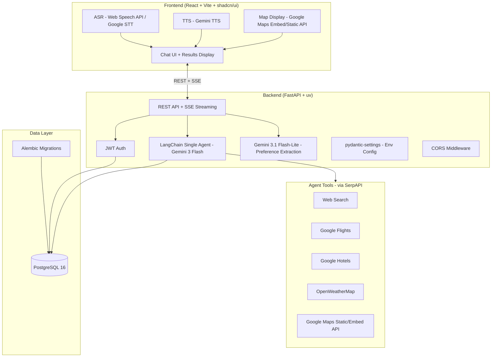

# 🗺️ `gogogo` — Full Infrastructure Plan

## 📐 High-Level Architecture



---

## 📁 Monorepo Structure

```
gogogo/
├── backend/
│   ├── app/
│   │   ├── api/
│   │   │   ├── routes/
│   │   │   │   ├── auth.py         # /auth/register, /auth/login
│   │   │   │   ├── chat.py         # /chat/stream (SSE)
│   │   │   │   ├── trips.py        # /trips CRUD
│   │   │   │   └── users.py        # /users/me, preferences
│   │   │   └── deps.py             # Shared dependencies (get_current_user, get_db)
│   │   ├── agent/
│   │   │   ├── agent.py            # LangChain agent setup
│   │   │   ├── tools/
│   │   │   │   ├── search.py       # Tavily / SerpAPI web search tool
│   │   │   │   ├── flights.py      # SerpAPI Google Flights tool
│   │   │   │   ├── hotels.py       # SerpAPI Google Hotels tool
│   │   │   │   ├── weather.py      # OpenWeatherMap tool
│   │   │   │   └── maps.py         # Google Maps Static API tool
│   │   │   └── schemas.py          # Structured Pydantic output models
│   │   ├── core/
│   │   │   ├── config.py           # pydantic-settings env config
│   │   │   ├── security.py         # JWT encode/decode
│   │   │   └── middleware.py       # CORS setup
│   │   ├── db/
│   │   │   ├── base.py             # SQLAlchemy declarative base
│   │   │   ├── session.py          # Async engine + session factory
│   │   │   └── models/
│   │   │       ├── user.py
│   │   │       ├── session.py
│   │   │       ├── message.py
│   │   │       ├── trip.py
│   │   │       └── preference.py
│   │   ├── repositories/           # DB access layer
│   │   │   ├── user_repo.py
│   │   │   ├── session_repo.py
│   │   │   ├── message_repo.py
│   │   │   ├── trip_repo.py
│   │   │   └── preference_repo.py
│   │   ├── schemas/                # Pydantic request/response schemas
│   │   │   ├── auth.py
│   │   │   ├── chat.py
│   │   │   ├── trip.py
│   │   │   └── user.py
│   │   ├── services/               # Business logic
│   │   │   ├── auth_service.py
│   │   │   ├── chat_service.py
│   │   │   ├── trip_service.py
│   │   │   └── preference_service.py
│   │   └── main.py                 # FastAPI app entrypoint
│   ├── alembic/
│   │   ├── versions/               # Migration files
│   │   └── env.py
│   ├── tests/
│   ├── alembic.ini
│   ├── pyproject.toml              # uv managed
│   ├── .env                        # Local env vars (gitignored)
│   └── Dockerfile
├── frontend/
│   ├── src/
│   │   ├── components/
│   │   │   ├── ui/                 # shadcn/ui primitives
│   │   │   ├── chat/               # ChatWindow, MessageBubble, InputBar
│   │   │   ├── trip/               # ItineraryCard, HotelCard, FlightCard
│   │   │   ├── map/                # MapEmbed (Google Maps Embed API)
│   │   │   └── voice/              # VoiceButton, TTSPlayer
│   │   ├── pages/
│   │   │   ├── LoginPage.tsx
│   │   │   ├── ChatPage.tsx
│   │   │   └── TripPage.tsx
│   │   ├── hooks/
│   │   │   ├── useASR.ts           # Speech-to-text hook
│   │   │   ├── useTTS.ts           # Text-to-speech hook
│   │   │   ├── useChat.ts          # SSE streaming hook
│   │   │   └── useAuth.ts          # Auth state hook
│   │   ├── services/
│   │   │   ├── api.ts              # Axios base client
│   │   │   ├── authService.ts
│   │   │   ├── chatService.ts
│   │   │   └── tripService.ts
│   │   ├── store/                  # Zustand or React Context
│   │   └── main.tsx
│   ├── package.json
│   ├── vite.config.ts
│   └── Dockerfile
├── docker-compose.yml
├── .env.example                    # Committed to git, no secrets
├── .gitignore
└── README.md
```

---

## 🗄️ Database Schema

### Tables

| Table              | Key Columns                                                                           | Notes                   |
| ------------------ | ------------------------------------------------------------------------------------- | ----------------------- |
| `users`            | `id`, `username`, `email`, `hashed_password`, `created_at`                            | Basic auth              |
| `chat_sessions`    | `id`, `user_id`, `title`, `created_at`                                                | One per conversation    |
| `messages`         | `id`, `session_id`, `role` (user/assistant), `content`, `created_at`                  | Full chat history       |
| `trips`            | `id`, `user_id`, `session_id`, `title`, `destination`, `itinerary_json`, `created_at` | JSONB for full plan     |
| `user_preferences` | `id`, `user_id`, `preferences_json`, `updated_at`                                     | Extracted by Flash-Lite |

### Itinerary JSONB Structure (Pydantic-enforced)

```python
class AttractionItem(BaseModel):
    name: str
    description: str
    category: str          # museum, restaurant, landmark, etc.
    address: str
    photo_url: str | None
    rating: float | None

class HotelItem(BaseModel):
    name: str
    address: str
    price_per_night: str
    rating: float | None
    photo_url: str | None
    booking_url: str | None

class FlightItem(BaseModel):
    airline: str
    departure: str
    arrival: str
    duration: str
    price: str
    booking_url: str | None

class DayPlan(BaseModel):
    day: int
    date: str | None
    attractions: list[AttractionItem]
    meals: list[AttractionItem]

class TripItinerary(BaseModel):
    destination: str
    duration_days: int
    summary: str
    days: list[DayPlan]
    hotels: list[HotelItem]
    flights: list[FlightItem]
    weather_summary: str | None
    map_embed_url: str | None
```

> The agent is forced to output this exact structure via LangChain's **structured output** (`.with_structured_output(TripItinerary)`). No free-form JSON guessing.

---

## 🔑 API Keys Needed

| Service              | Purpose                                               | Free Tier             | Sign Up                  |
| -------------------- | ----------------------------------------------------- | --------------------- | ------------------------ |
| **Google AI Studio** | Gemini 3 Flash (agent) + 3.1 Flash-Lite (preferences) | ✅ Generous free tier | aistudio.google.com      |
| **Google Cloud TTS** | Gemini TTS for voice output                           | ✅ 1M chars/mo        | console.cloud.google.com |
| **SerpAPI**          | Flights + Hotels + Web Search                         | ✅ 100 searches/mo    | serpapi.com              |
| **OpenWeatherMap**   | Weather data                                          | ✅ 1000 req/day       | openweathermap.org       |
| **Google Maps**      | Static/Embed map display                              | ✅ $200 credit/mo     | console.cloud.google.com |

> 💡 All 5 services have free tiers sufficient for a demo. Total cost for a presentation: **$0**.

---

## 🗣️ ASR & TTS Options

### ASR (Speech → Text) — Input

| Option                              | Quality               | Cost                      | Complexity         | Recommendation              |
| ----------------------------------- | --------------------- | ------------------------- | ------------------ | --------------------------- |
| **Web Speech API** (browser-native) | Good                  | Free                      | None (zero setup)  | ✅ **Recommended for demo** |
| **Google Cloud Speech-to-Text**     | Excellent             | Free 60min/mo             | Medium (GCP setup) | Good if quality matters     |
| **Gemini Live API**                 | Excellent, multimodal | Included w/ Gemini        | Medium             | Future upgrade path         |
| **Whisper (OpenAI)**                | Excellent             | Paid API / Free self-host | High (self-host)   | Overkill for demo           |

> **Verdict:** Use **Web Speech API** for ASR. It's free, zero-setup, works in Chrome, and is more than sufficient for a demo. Audio never leaves the browser.

---

### TTS (Text → Speech) — Output

| Option                             | Quality               | Cost                 | Complexity                    | Recommendation            |
| ---------------------------------- | --------------------- | -------------------- | ----------------------------- | ------------------------- |
| **Gemini TTS** (Google Cloud)      | Excellent, expressive | ✅ 1M chars/mo free  | Low (same GCP account)        | ✅ **Recommended**        |
| **Google Cloud TTS (WaveNet)**     | Very good             | ✅ 1M chars/mo free  | Low                           | Solid fallback            |
| **OpenAI TTS-1**                   | Very natural          | Paid (~$15/1M chars) | Low                           | Extra vendor, costs money |
| **ElevenLabs**                     | Best quality          | Free 10k chars/mo    | Low                           | Very limited free tier    |
| **Kokoro / Coqui TTS**             | Good, open-source     | Free (self-hosted)   | High (extra Docker container) | Overkill for demo         |
| **Web Speech API SpeechSynthesis** | Robotic               | Free                 | None                          | Last resort fallback      |

> **Verdict:** Use **Gemini TTS** — stays in Google ecosystem, same billing account, high quality, and free tier is generous enough for a demo.

---

## 🐳 Docker Setup (Dev)

### Containers

| Container  | Image             | Ports  | Purpose                    |
| ---------- | ----------------- | ------ | -------------------------- |
| `db`       | `postgres:16`     | `5432` | PostgreSQL database        |
| `backend`  | Custom Dockerfile | `8000` | FastAPI + uvicorn --reload |
| `frontend` | Custom Dockerfile | `5173` | Vite dev server + HMR      |

### Key Docker Practices

- Backend & frontend code → **volume-mounted** (not copied) for hot-reload
- PostgreSQL data → **named volume** (`postgres_data`) to persist across restarts
- `.env` file → passed into containers via `env_file` directive
- `depends_on` with `healthcheck` on `db` so backend waits for Postgres to be ready

---

## ⚙️ Environment Config (pydantic-settings)

```python
# app/core/config.py
class Settings(BaseSettings):
    # Database
    DATABASE_URL: str

    # Auth
    SECRET_KEY: str
    ACCESS_TOKEN_EXPIRE_MINUTES: int = 60

    # Gemini
    GEMINI_API_KEY: str
    GEMINI_MODEL: str = "gemini-3-flash"
    GEMINI_LITE_MODEL: str = "gemini-3.1-flash-lite"

    # SerpAPI
    SERPAPI_KEY: str

    # OpenWeatherMap
    OPENWEATHER_API_KEY: str

    # Google Maps
    GOOGLE_MAPS_API_KEY: str

    # Google Cloud TTS
    GOOGLE_TTS_API_KEY: str

    model_config = SettingsConfigDict(env_file=".env")

settings = Settings()
```

---

## 🔒 CORS Config

```python
# app/core/middleware.py
app.add_middleware(
    CORSMiddleware,
    allow_origins=["http://localhost:5173"],  # Vite dev server
    allow_credentials=True,
    allow_methods=["*"],
    allow_headers=["*"],
)
```

---

## 🤖 Agent Design

### Single Agent with Tools

```
User Message
    │
    ▼
System Prompt (injected user preferences + trip context)
    │
    ▼
Gemini 3 Flash (LangChain Agent)
    ├── Tool: web_search        → SerpAPI general search
    ├── Tool: search_flights    → SerpAPI Google Flights
    ├── Tool: search_hotels     → SerpAPI Google Hotels
    ├── Tool: get_weather       → OpenWeatherMap
    └── Tool: get_map_url       → Google Maps Static/Embed API
    │
    ▼
Structured Output → TripItinerary (Pydantic)
    │
    ▼
Streamed back to frontend via SSE
    │
    ▼
Gemini 3.1 Flash-Lite (async, background)
    └── Extracts preferences → saved to user_preferences table
```

---

## 🚦 Implementation Phases

| Phase               | Tasks                                                                                                               | Deliverable                                       |
| ------------------- | ------------------------------------------------------------------------------------------------------------------- | ------------------------------------------------- |
| **1 — Infra**       | Git init, Docker Compose, FastAPI skeleton, uv setup, Alembic init, React+Vite+shadcn init, CORS, pydantic-settings | Running `docker-compose up` with all 3 containers |
| **2 — Auth**        | User model + migration, register/login endpoints, JWT middleware, login page UI                                     | Working auth flow                                 |
| **3 — Agent Core**  | LangChain agent + Gemini, all 5 tools, structured Pydantic output, SSE streaming                                    | Agent returns structured trip plan                |
| **4 — Persistence** | Chat session + message save, trip save, preference extraction (Flash-Lite)                                          | Full DB integration                               |
| **5 — Frontend**    | Chat UI, voice input (Web Speech API), TTS playback (Gemini TTS), itinerary display, map embed                      | Full working demo                                 |
| **6 — A+ Polish**   | Weather-aware routing, preference memory injection, photos via SerpAPI, UI polish                                   | A+ features                                       |

---

## 📋 Tech Stack Summary

| Layer                     | Choice                                        |
| ------------------------- | --------------------------------------------- |
| Backend                   | FastAPI + uv + Python 3.12                    |
| ORM                       | SQLAlchemy (async)                            |
| Migrations                | Alembic                                       |
| Auth                      | JWT (python-jose + passlib)                   |
| Agent                     | LangChain + Gemini 3 Flash                    |
| Structured Output         | Pydantic models + `.with_structured_output()` |
| Lightweight LLM           | Gemini 3.1 Flash-Lite (preference extraction) |
| Search / Flights / Hotels | SerpAPI                                       |
| Weather                   | OpenWeatherMap                                |
| ASR                       | Web Speech API (browser-native)               |
| TTS                       | Gemini TTS (Google Cloud)                     |
| Maps                      | Google Maps Static / Embed API                |
| Frontend                  | React + Vite + TypeScript + shadcn/ui         |
| Database                  | PostgreSQL 16                                 |
| Containerization          | Docker + Docker Compose                       |
| Env Config                | pydantic-settings                             |
