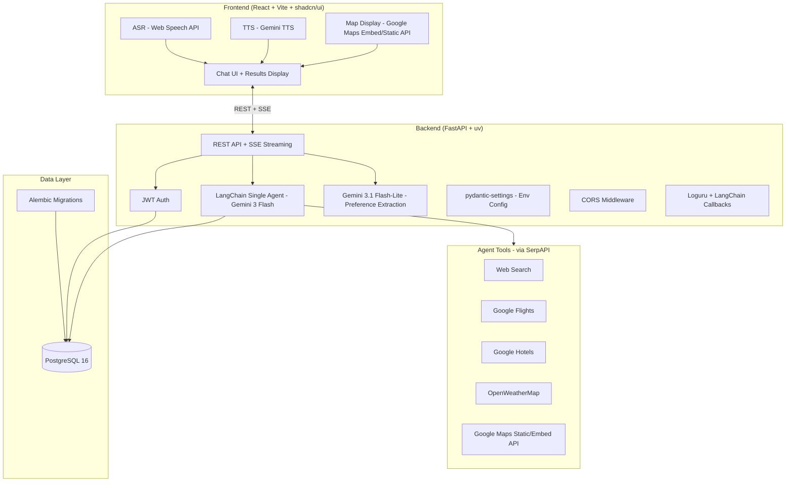

# 🗺️ `gogogo` — Full Infrastructure Plan

## 📐 High-Level Architecture



---

## 📁 Monorepo Structure

```
gogogo/
├── backend/
│   ├── app/
│   │   ├── api/
│   │   │   ├── routes/
│   │   │   │   ├── auth.py             # /auth/register, /auth/login
│   │   │   │   ├── chat.py             # /chat/stream (SSE)
│   │   │   │   ├── trips.py            # /trips CRUD
│   │   │   │   └── users.py            # /users/me, preferences
│   │   │   └── deps.py                 # get_current_user, get_db
│   │   ├── agent/
│   │   │   ├── agent.py                # LangChain agent setup
│   │   │   ├── callbacks.py            # Custom LangChain callback handler (logging)
│   │   │   ├── tools/
│   │   │   │   ├── search.py           # SerpAPI web search
│   │   │   │   ├── flights.py          # SerpAPI Google Flights
│   │   │   │   ├── hotels.py           # SerpAPI Google Hotels
│   │   │   │   ├── weather.py          # OpenWeatherMap
│   │   │   │   └── maps.py             # Google Maps Static/Embed
│   │   │   └── schemas.py              # Structured Pydantic output models
│   │   ├── core/
│   │   │   ├── config.py               # pydantic-settings env config
│   │   │   ├── security.py             # JWT encode/decode
│   │   │   ├── middleware.py           # CORS setup
│   │   │   └── logging.py              # Loguru setup
│   │   ├── db/
│   │   │   ├── base.py                 # SQLAlchemy declarative base
│   │   │   ├── session.py              # Async engine + session factory
│   │   │   └── models/
│   │   │       ├── user.py
│   │   │       ├── chat_session.py
│   │   │       ├── message.py
│   │   │       ├── trip.py
│   │   │       └── preference.py
│   │   ├── repositories/               # DB access layer (no expire_all!)
│   │   │   ├── user_repo.py
│   │   │   ├── session_repo.py
│   │   │   ├── message_repo.py
│   │   │   ├── trip_repo.py
│   │   │   └── preference_repo.py
│   │   ├── schemas/                    # Pydantic request/response schemas
│   │   │   ├── auth.py
│   │   │   ├── chat.py
│   │   │   ├── trip.py
│   │   │   └── user.py
│   │   ├── services/                   # Business logic
│   │   │   ├── auth_service.py
│   │   │   ├── chat_service.py
│   │   │   ├── trip_service.py
│   │   │   └── preference_service.py
│   │   └── main.py                     # FastAPI app entrypoint
│   ├── alembic/
│   │   ├── versions/
│   │   └── env.py
│   ├── logs/                           # Loguru output (gitignored)
│   ├── tests/
│   ├── alembic.ini
│   ├── pyproject.toml
│   ├── .env
│   └── Dockerfile
├── frontend/
│   ├── src/
│   │   ├── components/
│   │   │   ├── ui/                     # shadcn/ui primitives
│   │   │   ├── chat/                   # ChatWindow, MessageBubble, InputBar
│   │   │   ├── trip/                   # ItineraryCard, HotelCard, FlightCard
│   │   │   ├── map/                    # MapEmbed (Google Maps Embed API)
│   │   │   └── voice/                  # VoiceButton, TTSPlayer
│   │   ├── pages/
│   │   │   ├── LoginPage.tsx
│   │   │   ├── ChatPage.tsx
│   │   │   └── TripPage.tsx
│   │   ├── hooks/
│   │   │   ├── useASR.ts               # Web Speech API hook
│   │   │   ├── useTTS.ts               # Gemini TTS hook
│   │   │   ├── useChat.ts              # SSE streaming hook
│   │   │   └── useAuth.ts              # Auth state hook
│   │   ├── services/
│   │   │   ├── api.ts                  # Axios base client
│   │   │   ├── authService.ts
│   │   │   ├── chatService.ts
│   │   │   └── tripService.ts
│   │   ├── store/                      # Zustand global state
│   │   └── main.tsx
│   ├── package.json
│   ├── vite.config.ts
│   └── Dockerfile
├── docker-compose.yml
├── .env.example
├── .gitignore
└── README.md
```

---

## 🗄️ Database Schema

### Tables

| Table              | Key Columns                                                                           | Notes                   |
| ------------------ | ------------------------------------------------------------------------------------- | ----------------------- |
| `users`            | `id`, `username`, `email`, `hashed_password`, `created_at`                            | Basic auth              |
| `chat_sessions`    | `id`, `user_id`, `title`, `created_at`                                                | One per conversation    |
| `messages`         | `id`, `session_id`, `role` (user/assistant), `content`, `created_at`                  | Full chat history       |
| `trips`            | `id`, `user_id`, `session_id`, `title`, `destination`, `itinerary_json`, `created_at` | JSONB structured plan   |
| `user_preferences` | `id`, `user_id`, `preferences_json`, `updated_at`                                     | Extracted by Flash-Lite |

### Itinerary Structured Output (Pydantic — enforced via `.with_structured_output()`)

```python
class AttractionItem(BaseModel):
    name: str
    description: str
    category: str           # museum, restaurant, landmark, etc.
    address: str
    photo_url: str | None
    rating: float | None

class HotelItem(BaseModel):
    name: str
    address: str
    price_per_night: str
    rating: float | None
    photo_url: str | None
    booking_url: str | None

class FlightItem(BaseModel):
    airline: str
    departure: str
    arrival: str
    duration: str
    price: str
    booking_url: str | None

class DayPlan(BaseModel):
    day: int
    date: str | None
    attractions: list[AttractionItem]
    meals: list[AttractionItem]

class TripItinerary(BaseModel):
    destination: str
    duration_days: int
    summary: str
    days: list[DayPlan]
    hotels: list[HotelItem]
    flights: list[FlightItem]
    weather_summary: str | None
    map_embed_url: str | None
```

---

## 🔑 API Keys Needed

| Service              | Purpose                         | Free Tier          |
| -------------------- | ------------------------------- | ------------------ |
| **Google AI Studio** | Gemini 3 Flash + 3.1 Flash-Lite | ✅ Generous        |
| **Google Cloud TTS** | Gemini TTS voice output         | ✅ 1M chars/mo     |
| **SerpAPI**          | Web search + Flights + Hotels   | ✅ 100 searches/mo |
| **OpenWeatherMap**   | Weather data                    | ✅ 1000 req/day    |
| **Google Maps**      | Static/Embed map display        | ✅ $200 credit/mo  |

> 💡 Total demo cost: **$0** across all services.

---

## 🗣️ ASR & TTS Options

### ASR (Speech → Text)

| Option                              | Quality               | Cost                  | Complexity | Verdict            |
| ----------------------------------- | --------------------- | --------------------- | ---------- | ------------------ |
| **Web Speech API** (browser-native) | Good                  | Free                  | None       | ✅ **Recommended** |
| **Google Cloud STT**                | Excellent             | Free 60min/mo         | Medium     | Good upgrade path  |
| **Gemini Live API**                 | Excellent, multimodal | Included w/ Gemini    | Medium     | Future upgrade     |
| **Whisper (OpenAI)**                | Excellent             | Paid / Free self-host | High       | Overkill for demo  |

> **Decision:** Web Speech API — free, zero setup, works in Chrome, audio stays in browser.

### TTS (Text → Speech)

| Option                         | Quality               | Cost                | Complexity | Verdict                   |
| ------------------------------ | --------------------- | ------------------- | ---------- | ------------------------- |
| **Gemini TTS**                 | Excellent, expressive | ✅ 1M chars/mo free | Low        | ✅ **Recommended**        |
| **Google Cloud TTS (WaveNet)** | Very good             | ✅ 1M chars/mo free | Low        | Solid fallback            |
| **OpenAI TTS-1**               | Very natural          | ~$15/1M chars       | Low        | Extra vendor, costs money |
| **ElevenLabs**                 | Best quality          | Free 10k chars/mo   | Low        | Very limited free tier    |
| **Kokoro / Coqui TTS**         | Good                  | Free (self-hosted)  | High       | Overkill for demo         |
| **Web Speech SpeechSynthesis** | Robotic               | Free                | None       | Last resort fallback      |

> **Decision:** Gemini TTS — same Google ecosystem, same billing, high quality, generous free tier.

---

## 🤖 Agent Design

```
User Message
    │
    ▼
System Prompt (injected user preferences + session context)
    │
    ▼
Gemini 3 Flash — LangChain Agent
    ├── Tool: web_search        → SerpAPI general search
    ├── Tool: search_flights    → SerpAPI Google Flights
    ├── Tool: search_hotels     → SerpAPI Google Hotels
    ├── Tool: get_weather       → OpenWeatherMap
    └── Tool: get_map_url       → Google Maps Static/Embed API
    │
    ▼
Structured Output → TripItinerary (Pydantic + .with_structured_output())
    │
    ├──► Streamed to frontend via SSE
    │
    └──► Gemini 3.1 Flash-Lite (async background)
             └── Extracts preferences → saved to user_preferences table
```

---

## 📝 Logging Design

### Strategy: Two-Layer Logging

| Layer           | Tool                            | Purpose                               |
| --------------- | ------------------------------- | ------------------------------------- |
| **App-level**   | `loguru`                        | API requests, auth, DB ops, errors    |
| **Agent-level** | LangChain `BaseCallbackHandler` | Tool calls, LLM I/O, agent loop steps |

### Log Levels by Event

| Event                            | Level              |
| -------------------------------- | ------------------ |
| App startup / shutdown           | `INFO`             |
| Incoming API request             | `INFO`             |
| Auth success / failure           | `INFO` / `WARNING` |
| Agent action (tool call + input) | `INFO`             |
| Tool result (truncated)          | `INFO`             |
| LLM prompt / response preview    | `DEBUG`            |
| Agent finish (output keys)       | `SUCCESS`          |
| DB errors, unhandled exceptions  | `ERROR`            |
| Trip saved, preference updated   | `INFO`             |

### Log Outputs

| Sink               | Format                        | Rotation      |
| ------------------ | ----------------------------- | ------------- |
| **stdout**         | Colored, human-readable (dev) | —             |
| **`logs/app.log`** | Full structured logs          | 10MB / 7 days |

### Log Level via Env

```bash
# .env
LOG_LEVEL=DEBUG    # dev
LOG_LEVEL=INFO     # prod
```

### Sample Terminal Output

```
10:42:01 | INFO    | api.chat      - [POST /chat/stream] user_id=3 session_id=7
10:42:01 | INFO    | agent.callbacks - [TOOL CALL] search_hotels | {'query': 'hotels in Tokyo'}
10:42:02 | INFO    | agent.callbacks - [TOOL RESULT] [{'name': 'Shinjuku Granbell', 'price': '$120/night'}]...
10:42:02 | INFO    | agent.callbacks - [TOOL CALL] get_weather | {'city': 'Tokyo'}
10:42:03 | INFO    | agent.callbacks - [TOOL RESULT] {'temp': 18, 'condition': 'Partly Cloudy'}...
10:42:04 | SUCCESS | agent.callbacks - [AGENT FINISH] Output keys: ['destination', 'days', 'hotels', 'flights']
10:42:04 | INFO    | services.trip - Trip saved | trip_id=42 user_id=3
```

---

## ⚙️ Environment Config (`pydantic-settings`)

```python
class Settings(BaseSettings):
    DATABASE_URL: str
    SECRET_KEY: str
    ACCESS_TOKEN_EXPIRE_MINUTES: int = 60
    GEMINI_API_KEY: str
    GEMINI_MODEL: str = "gemini-3-flash"
    GEMINI_LITE_MODEL: str = "gemini-3.1-flash-lite"
    SERPAPI_KEY: str
    OPENWEATHER_API_KEY: str
    GOOGLE_MAPS_API_KEY: str
    GOOGLE_TTS_API_KEY: str
    LOG_LEVEL: str = "DEBUG"

    model_config = SettingsConfigDict(env_file=".env")
```

---

## 🔒 CORS Config

```python
app.add_middleware(
    CORSMiddleware,
    allow_origins=["http://localhost:5173"],   # Vite dev server
    allow_credentials=True,
    allow_methods=["*"],
    allow_headers=["*"],
)
```

---

## 🐳 Docker Setup

| Container  | Image         | Port   | Notes                                        |
| ---------- | ------------- | ------ | -------------------------------------------- |
| `db`       | `postgres:16` | `5432` | Named volume `postgres_data` for persistence |
| `backend`  | Custom        | `8000` | Code volume-mounted, `uvicorn --reload`      |
| `frontend` | Custom        | `5173` | Code volume-mounted, Vite HMR                |

> `backend` uses `depends_on` with a `healthcheck` on `db` to wait for Postgres readiness.

---

## 🚦 Implementation Phases

| Phase               | Tasks                                                                                                                             | Deliverable                                       |
| ------------------- | --------------------------------------------------------------------------------------------------------------------------------- | ------------------------------------------------- |
| **1 — Infra**       | Git init, Docker Compose, FastAPI skeleton, uv setup, Alembic init, React+Vite+shadcn init, CORS, pydantic-settings, Loguru setup | `docker-compose up` with all 3 containers healthy |
| **2 — Auth**        | User model + migration, register/login endpoints, JWT middleware, login page UI                                                   | Working auth flow end-to-end                      |
| **3 — Agent Core**  | LangChain agent + Gemini 3 Flash, all 5 tools, structured Pydantic output, SSE streaming, agent logging callbacks                 | Agent returns structured `TripItinerary`          |
| **4 — Persistence** | Chat session + message save, trip save, preference extraction via Flash-Lite                                                      | Full DB integration                               |
| **5 — Frontend**    | Chat UI, voice input (Web Speech API), TTS playback (Gemini TTS), itinerary display, map embed                                    | Full working demo                                 |
| **6 — A+ Polish**   | Weather-aware routing, preference memory injection, UI polish                                                                     | A+ features                                       |

---

## 📋 Tech Stack Summary

| Layer                     | Choice                                        |
| ------------------------- | --------------------------------------------- |
| Backend                   | FastAPI + uv + Python 3.12                    |
| ORM                       | SQLAlchemy (async)                            |
| Migrations                | Alembic                                       |
| Auth                      | JWT (python-jose + passlib)                   |
| Agent                     | LangChain + Gemini 3 Flash                    |
| Structured Output         | Pydantic + `.with_structured_output()`        |
| Lightweight LLM           | Gemini 3.1 Flash-Lite (preference extraction) |
| Search / Flights / Hotels | SerpAPI                                       |
| Weather                   | OpenWeatherMap                                |
| ASR                       | Web Speech API (browser-native)               |
| TTS                       | Gemini TTS (Google Cloud)                     |
| Maps                      | Google Maps Static / Embed API                |
| Frontend                  | React + Vite + TypeScript + shadcn/ui         |
| State Management          | Zustand                                       |
| Database                  | PostgreSQL 16                                 |
| Containerization          | Docker + Docker Compose                       |
| Env Config                | pydantic-settings                             |
| Logging                   | Loguru (app) + LangChain Callbacks (agent)    |
