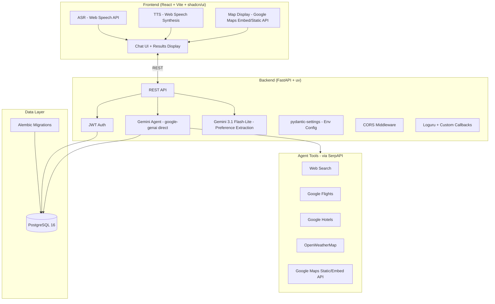

# 🗺️ `gogogo` — Full Infrastructure Plan

## 📐 High-Level Architecture



---

## 📁 Monorepo Structure

```
gogogo/
├── backend/
│   ├── app/
│   │   ├── api/
│   │   │   ├── routes/
│   │   │   │   ├── auth.py             # /auth/register, /auth/login
│   │   │   │   ├── chat.py             # POST /chat
│   │   │   │   ├── trips.py            # /trips CRUD
│   │   │   │   ├── users.py            # /users/me, preferences
│   │   │   │   └── health.py           # /health
│   │   │   └── deps.py                 # get_current_user, get_db
│   │   ├── agent/
│   │   │   ├── agent.py                # google-genai agent setup
│   │   │   ├── callbacks.py            # Custom callback handler (logging)
│   │   │   ├── tools/
│   │   │   │   ├── search.py           # Tavily + SerpAPI web search
│   │   │   │   ├── flights.py          # SerpAPI Google Flights
│   │   │   │   ├── hotels.py           # SerpAPI Google Hotels
│   │   │   │   ├── weather.py          # OpenWeatherMap
│   │   │   │   └── maps.py             # Google Maps Static/Embed
│   │   │   └── schemas.py              # Structured Pydantic output models
│   │   ├── core/
│   │   │   ├── config.py               # pydantic-settings env config
│   │   │   ├── security.py             # JWT encode/decode
│   │   │   ├── middleware.py           # CORS setup
│   │   │   └── logging.py              # Loguru setup
│   │   ├── db/
│   │   │   ├── base.py                 # SQLAlchemy declarative base
│   │   │   ├── session.py              # Async engine + session factory
│   │   │   └── models/
│   │   │       ├── user.py
│   │   │       ├── chat_session.py
│   │   │       ├── message.py
│   │   │       ├── trip.py
│   │   │       └── preference.py
│   │   ├── repositories/               # DB access layer (no expire_all!)
│   │   │   ├── user_repo.py
│   │   │   ├── session_repo.py
│   │   │   ├── message_repo.py
│   │   │   ├── trip_repo.py
│   │   │   └── preference_repo.py
│   │   ├── schemas/                    # Pydantic request/response schemas
│   │   │   ├── auth.py
│   │   │   ├── chat.py
│   │   │   ├── trip.py
│   │   │   └── user.py
│   │   ├── services/                   # Business logic
│   │   │   ├── auth_service.py
│   │   │   ├── chat_service.py          # Agent invocation (David)
│   │   │   ├── chat_history_service.py  # append_user/agent_message (Minqi)
│   │   │   ├── message_service.py       # Message persistence (Minqi)
│   │   │   ├── trip_service.py
│   │   │   └── preference_service.py
│   │   └── main.py                     # FastAPI app entrypoint
│   ├── alembic/
│   │   ├── versions/
│   │   └── env.py
│   ├── logs/                           # Loguru output (gitignored)
│   ├── tests/
│   ├── alembic.ini
│   ├── pyproject.toml
│   ├── .env
│   └── Dockerfile
├── frontend/
│   ├── src/
│   │   ├── components/
│   │   │   ├── ui/                     # shadcn/ui primitives
│   │   │   ├── chat/                   # ChatWindow, MessageBubble, InputBar
│   │   │   ├── trip/                   # ItineraryCard, HotelCard, FlightCard
│   │   │   ├── map/                    # MapEmbed (Google Maps Embed API)
│   │   │   └── voice/                  # VoiceButton, TTSPlayer
│   │   ├── pages/
│   │   │   ├── LoginPage.tsx
│   │   │   ├── ChatPage.tsx
│   │   │   └── TripPage.tsx
│   │   ├── hooks/
│   │   │   ├── useASR.ts               # Web Speech API hook
│   │   │   ├── useTTS.ts               # Web Speech Synthesis hook
│   │   │   ├── useChat.ts              # Chat request hook
│   │   │   └── useAuth.ts              # Auth state hook
│   │   ├── services/
│   │   │   ├── api.ts                  # Axios base client
│   │   │   ├── authService.ts
│   │   │   ├── chatService.ts
│   │   │   └── tripService.ts
│   │   ├── store/                      # Zustand global state
│   │   └── main.tsx
│   ├── package.json
│   ├── vite.config.ts
│   └── Dockerfile
├── docker-compose.yml
├── .env.example
├── .gitignore
└── README.md
```

---

## 🗄️ Database Schema

### Tables

| Table              | Key Columns                                                                           | Notes                   |
| ------------------ | ------------------------------------------------------------------------------------- | ----------------------- |
| `users`            | `id`, `username`, `email`, `hashed_password`, `created_at`                            | Basic auth              |
| `chat_sessions`    | `id`, `user_id`, `title`, `created_at`                                                | One per conversation    |
| `messages`         | `id`, `session_id`, `role` (user/assistant), `content`, `created_at`                  | Full chat history       |
| `trips`            | `id`, `user_id`, `session_id`, `title`, `destination`, `itinerary_json`, `created_at` | JSONB structured plan   |
| `user_preferences` | `id`, `user_id`, `preferences_json`, `updated_at`                                     | Extracted by Flash-Lite |

### Itinerary Structured Output (Pydantic — enforced via `generate_content` + `response_json_schema`)

```python
class AttractionItem(BaseModel):
    name: str
    description: str
    category: str           # museum, restaurant, landmark, etc.
    address: str
    photo_url: str | None
    rating: float | None

class HotelItem(BaseModel):
    name: str
    address: str
    price_per_night: str
    rating: float | None
    photo_url: str | None
    booking_url: str | None

class FlightItem(BaseModel):
    airline: str
    departure: str
    arrival: str
    duration: str
    price: str
    booking_url: str | None

class DayPlan(BaseModel):
    day: int
    date: str | None
    attractions: list[AttractionItem]
    meals: list[AttractionItem]

class TripItinerary(BaseModel):
    destination: str
    duration_days: int
    summary: str
    days: list[DayPlan]
    hotels: list[HotelItem]
    flights: list[FlightItem]
    weather_summary: str | None
    map_embed_url: str | None
```

---

## 🔑 API Keys Needed

| Service              | Purpose                         | Free Tier         |
| -------------------- | ------------------------------- | ----------------- |
| **Google AI Studio** | Gemini 3 Flash + 3.1 Flash-Lite | ✅ Generous        |
| **Google Cloud TTS** | Gemini TTS voice output         | ✅ 1M chars/mo     |
| **SerpAPI**          | Web search + Flights + Hotels   | ✅ 100 searches/mo |
| **Tavily AI** (fallback) | Web search fallback          | ✅ 1000 searches/mo |
| **OpenWeatherMap**   | Weather data                    | ✅ 1000 req/day    |
| **Google Maps**      | Static/Embed map display        | ✅ $200 credit/mo  |

> 💡 Total demo cost: **$0** across all services.

---

## 🗣️ ASR & TTS Options

> **⚠️ Web Speech API Feedback Loop Risk**: Handling the Web Speech API alongside TTS can cause feedback loops (the mic picks up the TTS audio) or React state race conditions (user clicks mic while TTS is still playing). **Recommendation**: Ensure `useASR` explicitly mutes or pauses `useTTS` when recording starts. Add visual indicators (a pulsing mic) so the user knows exactly when the app is listening vs. speaking.

### ASR (Speech → Text)

| Option                              | Quality               | Cost                  | Complexity | Verdict           |
| ----------------------------------- | --------------------- | --------------------- | ---------- | ----------------- |
| **Web Speech API** (browser-native) | Good                  | Free                  | None       | ✅ **Recommended** |
| **Google Cloud STT**                | Excellent             | Free 60min/mo         | Medium     | Good upgrade path |
| **Gemini Live API**                 | Excellent, multimodal | Included w/ Gemini    | Medium     | Future upgrade    |
| **Whisper (OpenAI)**                | Excellent             | Paid / Free self-host | High       | Overkill for demo |

> **Decision:** Web Speech API — free, zero setup, works in Chrome, audio stays in browser.

### TTS (Text → Speech)

| Option                         | Quality               | Cost               | Complexity | Verdict                   |
| ------------------------------ | --------------------- | ------------------ | ---------- | ------------------------- |
| **Web Speech Synthesis**       | Basic                 | Free               | None       | ✅ **Recommended for demo** |
| **Gemini TTS**                 | Excellent, expressive | ✅ 1M chars/mo free | Low        | Future upgrade            |
| **Google Cloud TTS (WaveNet)** | Very good             | ✅ 1M chars/mo free | Low        | Solid fallback            |
| **OpenAI TTS-1**               | Very natural          | ~$15/1M chars      | Low        | Extra vendor, costs money |
| **ElevenLabs**                 | Best quality          | Free 10k chars/mo  | Low        | Very limited free tier    |

> **Decision:** Web Speech Synthesis — browser-native, zero backend, acceptable for demo. Gemini TTS as future upgrade.

### Future Upgrade: Gemini Live (Multimodal Voice)

| Aspect | Details |
|--------|---------|
| **What it is** | Google's native multimodal API — handles speech input + reasoning + speech output in one loop |
| **Pros** | Most natural voice experience, single API, impressive demo |
| **Cons** | WebSocket setup, audio streaming complexity, 4-week timeline risk |
| **Upgrade path** | Replace ASR hook + agent call + TTS hook with single Gemini Live session |
| **When to upgrade** | After core agent works (Week 3-4) if time permits |

> **Recommendation:** Ship with Web Speech API first. Gemini Live is a polished upgrade for after the core demo works.

---

## 🗣️ Voice I/O Flow

```
User Input (voice or text)
    │
    ├─── [Voice] Web Speech API (ASR) → transcript ──────────────────┐
    │                                                               │
    └─── [Text] typed directly ─────────────────────────────────────┘
                            │
                            ▼
                    Gemini 3 Flash Agent
                    (tools: search, flights, hotels, weather, maps)
                            │
                            ▼
                    Structured Output (TripItinerary)
                            │
              ┌─────────────┴─────────────┐
              │                           │
              ▼                           ▼
        Text Response              TTS Audio Output
        (ChatPage UI)              (Web Speech Synthesis)
```

**Step-by-step:**
1. **Input:** User speaks via mic (VoiceButton) or types in input bar
2. **STT:** Web Speech API (`useASR.ts`) converts audio → text transcript
3. **LLM:** Text sent to backend → Gemini 3 Flash agent with tools/APIs → structured trip plan
4. **TTS:** Text response sent to Web Speech Synthesis (`useTTS.ts`) → audio playback
5. **Output:** Both text (ChatPage) and audio play simultaneously

**Files:**
- `frontend/src/hooks/useASR.ts` — Web Speech API STT
- `frontend/src/hooks/useTTS.ts` — Web Speech Synthesis TTS
- `frontend/src/components/voice/VoiceButton.tsx` — Mic toggle
- `frontend/src/components/voice/TTSPlayer.tsx` — Auto-play TTS on agent response
- `backend/app/agent/agent.py` — Gemini 3 Flash with tools
- `backend/app/services/chat_service.py` — Agent invocation + structured output

**Future upgrade:** Replace STT → Agent → TTS chain with Gemini Live API (single multimodal WebSocket session).

---

## 🤖 Agent Design

### Agent Loop

> **⚠️ Loop Bound (MAX_ITERATIONS = 5)**: Keep the agent loop strictly bounded (e.g., `MAX_ITERATIONS = 5`) to prevent infinite loops if the LLM gets confused or cycles. Implement a hard iteration cap in `agent.py`.

> **⚠️ API Error Handling**: If an external API (like SerpAPI) fails, do **not** throw a 500 error. Instead, catch the exception in the tool and return a string like `{"error": "Flight API timeout, tell the user you cannot fetch flights right now."}`. This allows the LLM to gracefully apologize to the user instead of crashing the app. Each tool must handle its own exceptions and return error dicts.

**Phase 1 — Agent Loop with Structured Output**
```
User Message
    │
    ▼
System Prompt (injected user preferences + session context)
    │
    ▼
Gemini 3 Flash — agent loop with tools
    ├── Tool: web_search        → Tavily (primary) / SerpAPI (flights/hotels)
    ├── Tool: search_flights    → SerpAPI Google Flights
    ├── Tool: search_hotels     → SerpAPI Google Hotels
    ├── Tool: get_weather       → OpenWeatherMap
    └── Tool: get_map_url       → Google Maps Static/Embed API
    │
    ▼
Gemini 3 Flash → generate_content with response_json_schema → TripItinerary (Pydantic)
    │
    ▼
Final structured JSON → Frontend (itinerary display)
```

**Single-phase approach:** Gemini 3 Flash handles the agent loop and returns a structured `TripItinerary` directly via `generate_content` with `response_json_schema`. No SSE streaming — the POST /chat endpoint returns the complete structured response.

**Preference Extraction (async, per-session-end)**
```
Session End → Gemini 3.1 Flash-Lite → extract/update preferences → saved to user_preferences table
```

---

## 📝 Logging Design

### Strategy: Two-Layer Logging

| Layer           | Tool                            | Purpose                               |
| --------------- | ------------------------------- | ------------------------------------- |
| **App-level**   | `loguru`                        | API requests, auth, DB ops, errors    |
| **Agent-level** | Custom Loguru callbacks | Tool calls, LLM I/O, agent loop steps |

### Log Levels by Event

| Event                            | Level              |
| -------------------------------- | ------------------ |
| App startup / shutdown           | `INFO`             |
| Incoming API request             | `INFO`             |
| Auth success / failure           | `INFO` / `WARNING` |
| Agent action (tool call + input) | `INFO`             |
| Tool result (truncated)          | `INFO`             |
| LLM prompt / response preview    | `DEBUG`            |
| Agent finish (output keys)       | `SUCCESS`          |
| DB errors, unhandled exceptions  | `ERROR`            |
| Trip saved, preference updated   | `INFO`             |

### Log Outputs

| Sink               | Format                        | Rotation      |
| ------------------ | ----------------------------- | ------------- |
| **stdout**         | Colored, human-readable (dev) | —             |
| **`logs/app.log`** | Full structured logs          | 10MB / 7 days |

### Log Level via Env

```bash
# .env
LOG_LEVEL=DEBUG    # dev
LOG_LEVEL=INFO     # prod
```

### Sample Terminal Output

```
10:42:01 | INFO    | api.chat      - [POST /chat] user_id=3 session_id=7
10:42:01 | INFO    | agent.callbacks - [TOOL CALL] search_hotels | {'query': 'hotels in Tokyo'}
10:42:02 | INFO    | agent.callbacks - [TOOL RESULT] [{'name': 'Shinjuku Granbell', 'price': '$120/night'}]...
10:42:02 | INFO    | agent.callbacks - [TOOL CALL] get_weather | {'city': 'Tokyo'}
10:42:03 | INFO    | agent.callbacks - [TOOL RESULT] {'temp': 18, 'condition': 'Partly Cloudy'}...
10:42:04 | SUCCESS | agent.callbacks - [AGENT FINISH] Output keys: ['destination', 'days', 'hotels', 'flights']
10:42:04 | INFO    | services.trip - Trip saved | trip_id=42 user_id=3
```

---

## 🧪 Testing Strategy

Minimal coverage for demo — focus on agent tools and auth.

| Layer           | Scope                                                                                                       | Tools                          |
| --------------- | ----------------------------------------------------------------------------------------------------------- | ------------------------------ |
| **Unit**        | Agent tools (search, flights, hotels, weather, maps), Pydantic schemas, JWT encode/decode, password hashing | `pytest`                       |
| **Integration** | API endpoints (auth, chat, trips), DB operations                                                     | `pytest` + `httpx.AsyncClient` |

### What to Test

- `auth_service.py` — register, login, password verify
- `agent/tools/*.py` — each tool returns expected shape
- `schemas.py` — `TripItinerary` validates correctly
- `security.py` — JWT encode/decode roundtrip
- `/auth/register`, `/auth/login` — returns token, correct status codes
- `/chat` — POST /chat returns TripItinerary shape
- `/trips` — CRUD roundtrip

### What to Skip

- E2E tests (manual demo walkthrough sufficient)
- Frontend component tests (shadcn/ui is tested upstream)
- Load/stress testing (demo scale)

### Implementation

```
backend/tests/
├── unit/
│   ├── test_tools/          # One file per tool
│   ├── test_schemas/         # Pydantic validation
│   └── test_security/        # JWT, password hashing
├── integration/
│   ├── test_auth/            # /register, /login
│   ├── test_chat/            # /chat
│   └── test_trips/           # CRUD
└── conftest.py               # Shared fixtures (test db, async client)
```

---

## ⚙️ Environment Config (`pydantic-settings`)

```python
class Settings(BaseSettings):
    DATABASE_URL: str
    SECRET_KEY: str
    ACCESS_TOKEN_EXPIRE_MINUTES: int = 43200
    GEMINI_API_KEY: str
    GEMINI_MODEL: str = "gemini-3-flash-preview"
    GEMINI_LITE_MODEL: str = "gemini-3.1-flash-lite-preview"
    GEMINI_TTS_MODEL: str = "gemini-2.5-flash-preview-tts"
    SERPAPI_KEY: str
    TAVILY_API_KEY: str
    OPENWEATHER_API_KEY: str
    GOOGLE_MAPS_API_KEY: str
    LOG_LEVEL: str = "DEBUG"

    model_config = SettingsConfigDict(env_file=".env")
```

---

## 🔒 CORS Config

```python
app.add_middleware(
    CORSMiddleware,
    allow_origins=["http://localhost:5173"],   # Vite dev server
    allow_credentials=True,
    allow_methods=["*"],
    allow_headers=["*"],
)
```

---

## 🏥 Healthcheck Endpoint

```python
# backend/app/api/routes/health.py
@router.get("/health")
async def health_check():
    return {"status": "ok"}
```

> Used by Docker `healthcheck` to verify backend container is ready.

---

## 🐳 Docker Setup

| Container  | Image         | Port   | Notes                                        |
| ---------- | ------------- | ------ | -------------------------------------------- |
| `db`       | `postgres:16` | `5432` | Named volume `postgres_data` for persistence |
| `backend`  | Custom        | `8000` | Code volume-mounted, `uvicorn --reload`      |
| `frontend` | Custom        | `5173` | Code volume-mounted, Vite HMR                |

> `backend` uses `depends_on` with a `healthcheck` on `db` to wait for Postgres readiness.

---

## 🚦 Implementation Phases

| Phase               | Tasks                                                                                                                                                       | Deliverable                                       |
| ------------------- | ----------------------------------------------------------------------------------------------------------------------------------------------------------- | ------------------------------------------------- |
| **1 — Infra**       | Git init, Docker Compose, FastAPI skeleton, uv setup, Alembic init, React+Vite+shadcn init, CORS, pydantic-settings, Loguru setup                           | `docker-compose up` with all 3 containers healthy |
| **2 — Auth**        | User model + migration, register/login endpoints, JWT middleware, login page UI, unit tests for auth service                                                | Working auth flow end-to-end                      |
| **3 — Agent Core**  | google-genai direct + Gemini 3 Flash, all 5 tools, structured Pydantic output via response_json_schema, logging callbacks, unit tests for tools | Agent returns structured `TripItinerary`          |
| **4 — Persistence** | Chat session + message save, trip save, Flash-Lite extraction on session end                                                                                | Full DB integration                               |
| **5 — Frontend**    | Chat UI, voice input (Web Speech API), TTS playback (Web Speech Synthesis), itinerary display, map embed                                                              | Full working demo                                 |
| **6 — A+ Polish**   | Weather-aware routing, preference memory injection, UI polish                                                                                               | A+ features                                       |

---

## 📋 Tech Stack Summary

| Layer                     | Choice                                        |
| ------------------------- | --------------------------------------------- |
| Backend                   | FastAPI + uv + Python 3.12                    |
| ORM                       | SQLAlchemy                                    |
| Migrations                | Alembic                                       |
| Auth                      | JWT (python-jose + passlib)                   |
| Agent                     | google-genai + Gemini 3 Flash                 |
| Structured Output         | Pydantic + google-genai response_schema       |
| Lightweight LLM           | Gemini 3.1 Flash-Lite (preference extraction) |
| Search / Flights / Hotels | Tavily (search) + SerpAPI (flights/hotels)   |
| Weather                   | OpenWeatherMap                                |
| ASR                       | Web Speech API (browser-native)               |
| TTS                       | Web Speech Synthesis (browser-native)          |
| Maps                      | Google Maps Static / Embed API                |
| Frontend                  | React + Vite + TypeScript + shadcn/ui         |
| State Management          | Zustand                                       |
| Database                  | PostgreSQL 16                                 |
| Containerization          | Docker + Docker Compose                       |
| Env Config                | pydantic-settings                             |
| Logging                   | Loguru (app) + Custom Callbacks (agent)       |

---

## 🔮 Future Considerations (Post-Deadline / v2)

> These features are **descoped** from the Apr 16 deadline. Revisit only if all core features are done before Day 15.

### SSE Streaming
> **⚠️ SSE + DB Session Risk**: Do not hold a DB transaction open during streaming. Save user message before stream starts, collect response in memory, and save assistant message via background task after stream finishes using a separate DB session.

- [ ] Upgrade `POST /chat` → `GET /chat/stream` SSE endpoint
- [ ] Stream agent thinking steps + tool calls to frontend
- [ ] Update `useChat.ts` — consume SSE, show intermediate steps in UI
- [ ] Add 3x auto-retry on SSE disconnect

### Voice Upgrade
- [ ] Upgrade `useTTS.ts` from `window.speechSynthesis` → Gemini TTS
- [ ] **Gemini Live API** — single multimodal session replacing ASR + agent + TTS hooks entirely
